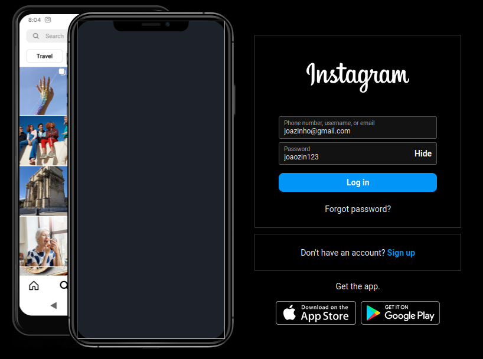
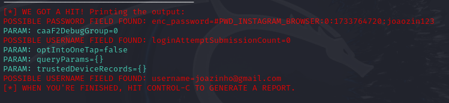

# Phishing para captura de senhas 

Este projeto faz parte de um desafio da Digital Innovation One (DIO) e demonstra como realizar um experimento de phishing utilizando o Social Engineering Toolkit (SEToolkit) e a funcionalidade de clonagem de sites.

⚠ Atenção: Este experimento é estritamente educacional. O uso indevido pode ser ilegal e resultar em penalidades severas. Certifique-se de obter permissão de todos os envolvidos antes de realizar qualquer teste.

## Requisitos

- Sistema operacional baseado em Linux (recomenda-se Kali Linux ou Parrot OS).
- SEToolkit instalado (já incluído em distribuições como Kali Linux).
- Permissões de administrador/root.
- Conexão de rede funcional.

## Realizando a clonagem do site

1. Acesso Root:
    ```bash
    sudo su
    ```
2. Iniciando o setoolkit:
    ```bash
    setoolkit
    ```
3. Selecione o tipo de ataque:
    ```bash
    Select from the menu:

    1) Social-Engineering Attacks

    ```

4. Selecione o vetor de ataque:
    ```bash
    Select from the menu:

    2) Website Attack Vectors

    ```

5. Selecione o método de ataque:
    ```bash

    3) Credential Harvester Attack Method

    ```
    em seguida:
    ```bash
    2) Site Cloner
    ```
6.Configuração do Servidor Web:

Digite o IP do servidor local.

Use o comando ifconfig ou ip a para verificar seu endereço IP.

7. Insira a `URL` que deseja clonar

- exemplo: `https://www.instagram.com/`

8. Servidor Ativo:

    O SEToolkit criará um servidor web local com o clone do site.
    Compartilhe o link gerado (IP do servidor) com o alvo, se aplicável, no ambiente de teste.

9.Coleta de Credenciais:

As credenciais inseridas no site clonado serão coletadas e exibidas no terminal onde o SEToolkit está sendo executado.
---------------------


***Resultado***
-------------------------------


-------------------------
### Aviso Legal
Este guia é fornecido apenas para fins educacionais e de pesquisa no contexto do desafio da DIO. Não nos responsabilizamos por qualquer uso inadequado ou ilegal deste material. Sempre siga as leis de sua jurisdição e utilize este conhecimento de maneira ética.
